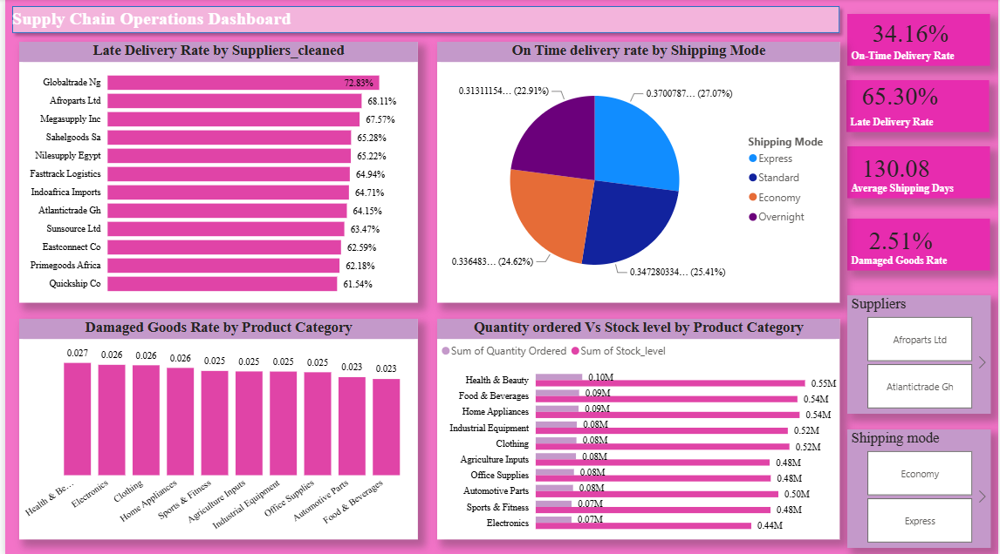
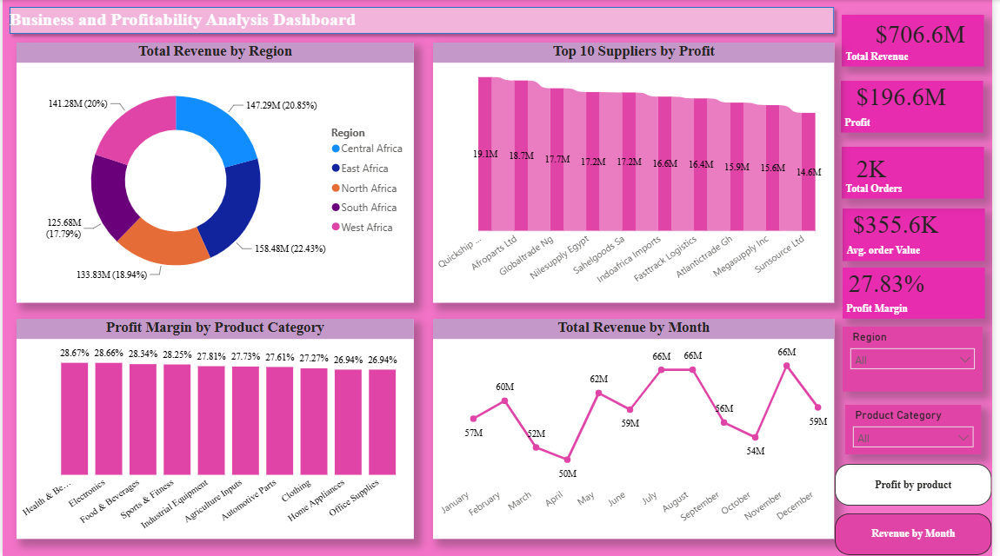

# 📊 GlobalMart Supply Chain & Business Analytics Dashboard

## Project Overview

This project presents an end-to-end business intelligence solution developed using **Microsoft Excel** and **Power BI** to analyze GlobalMart's supply chain operations and business performance across its African supplier network.

The dashboard transforms raw operational data into interactive visualizations that enable executives to monitor delivery performance, profitability, inventory health, and overall business trends for informed decision-making.

---

## Business Problem

GlobalMart was experiencing several operational and financial challenges that affected business performance:

- 🚚 High rate of late deliveries leading to customer dissatisfaction
- 📦 Inventory imbalance resulting in stock shortages and excess inventory
- 💰 Revenue growth with stagnant profit margins
- 📈 Limited visibility due to fragmented and static reporting systems

The objective of this project was to build an interactive analytics dashboard capable of providing actionable insights into these business challenges.

---

## Project Objectives

The dashboard was designed to:

- Analyze delivery performance across suppliers and shipping modes.
- Evaluate profitability by region, supplier, and product category.
- Assess inventory efficiency and damaged goods.
- Monitor monthly business trends.
- Provide data-driven recommendations for executive decision-making.

---

## Tools & Technologies

- **Microsoft Excel**
  - Data Cleaning
  - Data Validation
  - Data Transformation

- **Microsoft Power BI**
  - Data Modeling
  - DAX Measures
  - Interactive Dashboards
  - KPI Cards
  - Maps
  - Slicers
  - Drill-through Analysis

---

## Data Cleaning & Preparation

Several preprocessing steps were performed before visualization:

- Removed duplicate records.
- Handled missing values.
- Standardized supplier names and shipping modes.
- Corrected inconsistent date formats.
- Fixed formatting inconsistencies.
- Validated dataset integrity.

---

## Dataset Summary

| Metric | Value |
|---------|-------|
| Total Revenue | **$706.6M** |
| Total Profit | **$196.6M** |
| Total Orders | **2,000+** |
| Average Order Value | **$355.6K** |
| Profit Margin | **27.83%** |

### Dataset Dimensions

- **Regions:** Central, East, North, South, West Africa
- **Suppliers:** 12
- **Product Categories:** 10
- **Shipping Modes:** 4
- **Measures:** Sales, Cost, Profit, Orders, Quantity, Stock Level, Shipping Days

---

# Dashboard Overview

## 1. Business & Profitability Dashboard

Provides insights into:

- Revenue
- Profit
- Profit Margin
- Supplier Performance
- Regional Performance
- Category Analysis
- Monthly Revenue Trends

### Key Insights

- East Africa generated the highest revenue.
- Health & Beauty delivered the highest profit and profit margin.
- Quickship Co was the most profitable supplier.
- Revenue fluctuates seasonally with noticeable peaks during February, May, July, August, and November.

---

## 2. Supply Chain Operations Dashboard

Focuses on operational efficiency by monitoring:

- Delivery Performance
- Shipping Mode Efficiency
- Supplier Performance
- Inventory Levels
- Damaged Goods
- Stock vs Demand

### Key Insights

- Only **34.16%** of deliveries arrived on time.
- Late delivery rate reached **65.30%**.
- Express shipping recorded the highest on-time delivery performance.
- GlobalTrade Ng and Afroparts Ltd were the poorest-performing suppliers.
- Inventory levels were significantly higher than customer demand.
  
  

---

# Major Findings

## Delivery Performance

- High late-delivery rates across most suppliers.
- Supplier performance varied significantly.
- Express shipping consistently outperformed other shipping methods.

---

## Profitability

- Health & Beauty was the most profitable category.
- East Africa generated the largest revenue contribution.
- Profitability differed considerably among suppliers.

---

## Inventory

- Overstocking was observed across several product categories.
- Inventory levels were not aligned with actual demand.
- Health & Beauty recorded the highest damaged goods rate despite being the most profitable category.


---

## Business Trends

Monthly revenue analysis revealed recurring seasonal demand patterns, indicating opportunities for:

- Better inventory planning
- Promotional campaigns
- Demand forecasting

---

# Recommendations

Based on the analysis, the following actions are recommended:

1. Improve supplier performance through SLA reviews and supplier evaluation.
2. Increase the use of Express shipping where operationally feasible.
3. Align inventory with actual customer demand.
4. Improve packaging and handling procedures for Health & Beauty products.
5. Expand real-time Power BI reporting across the organization.

---

# Dashboard Features

- Interactive slicers
- KPI cards
- Drill-down analysis
- Dynamic filtering
- Regional performance visualization
- Supplier comparison
- Category analysis
- Monthly trend analysis
- Inventory monitoring

---

# Project Workflow

```text
Raw Dataset
      │
      ▼
Excel Data Cleaning
      │
      ▼
Data Validation
      │
      ▼
Power BI Data Model
      │
      ▼
DAX Measures
      │
      ▼
Interactive Dashboards
      │
      ▼
Business Insights & Recommendations
```

---

# Business Impact

This dashboard enables decision-makers to:

- Monitor operational performance in real time.
- Identify underperforming suppliers.
- Optimize inventory allocation.
- Improve delivery efficiency.
- Increase profitability through data-driven decisions.
- Replace static reporting with interactive business intelligence.

---

# Project Deliverables

- Power BI Dashboard
- Executive Presentation
- Business Performance Analysis
- Supply Chain Performance Analysis
- Strategic Recommendations

---

# Author

**Maryam Zubair Titilayo**

**Business Intelligence | Data Analyst | Power BI Developer**

- Microsoft Excel
- Power BI
- Data Cleaning
- Data Modeling
- DAX
- Business Intelligence
- Data Visualization

---

# Acknowledgements

This project was developed as a business analytics case study demonstrating how modern Business Intelligence tools can transform raw operational data into strategic insights for executive decision-making.

---

## License

This project is intended for educational and portfolio purposes.
